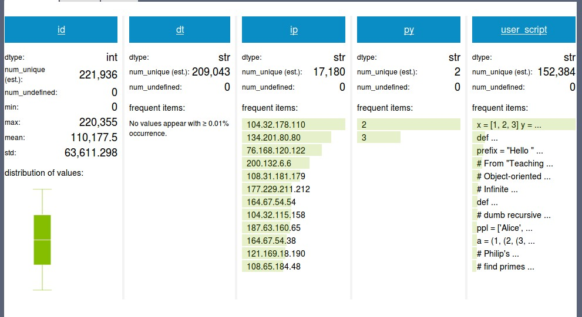

Python Tutor Data Analysis Project
Post 1 - Raw Data Analysis
=============

For the initial stage of the analysis project for the Python Tutor data we went and did some basic
statistical analysis of the raw data. In addition we were able to come up with some statistics
on the types of compiler errors in the submitted code.

In order to do this cleanly, we made use of a product called GraphLab, which can be found at www.graphlab.com. This
software package has a very clean Python API, and can read data directly from JSON. This gave us a very clean, and quick
way to get right to doing analysis on the data.

Data
=============

The first step in analyzing any data is to take a look at the format of the data, and what fields are contained in it.
Python Data came to us in the form of 'submissions' encoded in JSON format. An example of one such record is shown below.

```
JSON Sample
{
	"ip": "75.147.182.5", 
	"dt": "2014-07-01 00:00:02", 
	"py": 2, 
	"user_script": "def odd(x):\n  \n   x%2 != 0\n   return True\n   else\n   return False\n\nodd(10)"
}
```

Every time a user presses the `submit` button through the python tutor one of these records is generated. You can
see that we have access to the IP Address of the user, the date and time of submission, what version of Python they
are writing code for, and the actual code the user is attempting to run.

One thing we can notice here is that we can 'localize' a user by the IP Address, but because of shared usage this may
not be enough, so we may also be able to make use of the actual date and time to bind a user to a 'time slice'. 

Having the Python version and the code allows us to execute the code on the appropriate interpreter, which has the potential to allow us to make inferences as to errors, and what a user does when encountered with errors.

Using GraphLab
=============

Graph lab uses what they call an `SFrame`, which is somewhat similar to a fixed data model. The application makes use of this frame when doing all of it's internal calculation and processing. Therefore, the first step to using it is to place the
data you want to analyze into such a frame. 

First, the JSON had to be specially formatted, turning each record of the data into a list. The code to do this operation is below:

``` python
def add_brackets(json_dict):
    for key in json_dict.keys():
        # add '[' and ']' to make dict val a list instead of str
        #which is required by graphlab.SFrame
        json_dict[key] = [json_dict[key]]

    return json_dict

def main():
    with open('../../Data/data_file.txt','r') as data:
        with open('../../Data/data_file_modified.txt', 'w') as out_file:
            for line in data:
                line = add_brackets(json.loads(line))
		out_file.write(json.dumps(line)+'\n')

```

Following this processing we were able to convert this new data into an SFrame for further processing. A truncated version
of the function we used to create the frame is given below:

``` python
def main():
    with open('../../Data/data_file_modified.txt') as data:
        sf = SFrame()
        
	dt = [] # Each column gets created as a list.
	.
	.
	.
        for i, line in enumerate(data):
            jo = json.loads(line) # Load in the JSON.
            dt += jo['dt']	  # Add in each element for this record to our lists.
	.
	.
	.
	# Create the columns for the frame and then store it.
        sf = sf.add_column(SArray(id), name='id')
        sf.add_column(SArray(dt), name='dt')
        sf.add_column(SArray(ip), name='ip')
        sf.add_column(SArray(py, dtype=str), name='py')
        sf.add_column(SArray(script), name='user_script')

        sf.save('python_tutor')
```

The result of all of this is we have saved an `SFrame` containing our data, and we can now load, manipulate, and even
display information about this frame as we'll see below.


Basic Statistics
=============

Once `SFrames` are created and stored, you can easily reload them from the directory they are stored in. This is accomplished
using the following Python code:

``` python
import graphlab
sf = graphlab.load_sframe("python_tutor")
sf.show()
```

The last line of code above creates a very nice web based interface out your frame. For the original JSON data we wanted to get
some very basic statistics on the records. Below is a screen cap of the results of the `.show()` method call.



As you can see GraphLab gives us a really nice visual characterization of the data, with little code actually written to obtain it.

- The dataset for the month of July gives us a total of 221,936 submissions.
- We have 17,180 unique IP addresses, which gives us potentially that many users. In fact we're hoping that after further
grouping of the submissions based on date range we'll be able to classify even more 'users' from this single month of data.
- You can see that Python 2 code submissions are much more frequent than Python 3 code submissions, 70% of the submissions
are Python 2 code, with 30% being Python 3.


Error Statistics
=============

- How did we get the errors (python code samples)

- actual statistics found (split up into both Python versions)
