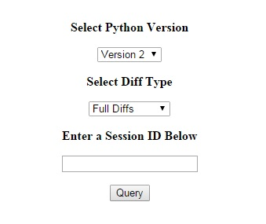
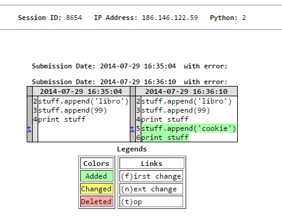

Python Tutor Data Analysis Project
=============

Python Tutor is a free web based tool created by Phillip Guo located here http://pythontutor.com/. This tool allows a Python Programmer to obtain a visualization of their Python code, and the ability to step through each line to view Python's internal object structure as the code is executed.

The interesting part that we'll be looking at in this project is the fact that this program stores the code a user executes, allowing us at the backend to do some analysis of the code users submit.

For instance each submission to the site is timestamped and ipaddress logged, allowing us to view a history of each users code submissions. For this project we'll have access to JSON encoded records of the information provided to the site.

Python tutor submissions are stored in JSON format, one example of this is below.

```
JSON Sample
{
	"ip": "75.147.182.5", 
	"dt": "2014-07-01 00:00:02", 
	"py": 2, 
	"user_script": "def odd(x):\n  \n   x%2 != 0\n   return True\n   else\n   return False\n\nodd(10)"
}
```


Problem Statement
=============

The Nature and Scale of the Python Tutor Data gives us many potential problems to look at. Since we have so much data from so many different users there are many problems that can be looked at.

- One problem we can approach is to use this data to get at an analysis of programmer mistakes made by novice programers. Can we see interesting or frequent mistakes that new programmers make when writing Python code?

Getting at a solution to the above problem is an extensive task, quite a bit larger than the scope of this courses project. However in the spirit of that overall goal we identified several smaller problems we can get a handle on in the time we had that will help in furthering that goal.

- What type of data model or storage system works well for further analysis of the data?
- Is there a good way to visualize the data, in such a way where we can ask for further 'expert' input into the data for use in
further analysis?
- How to best separate the submissions into a 'session' so we can identify a specific 'user' in analysis of the data.
- What are the basic statistics of the data, how many error types are there, how many 'sessions' can we see in a typical month of submissions?

Why is this interesting?
=============

Analysis of novice programmer mistakes has many facets to it. 

- A large aspect of this analysis is by loookig at mistakes that are common for programmers we can help direct education and training.
- We can also look at the usefulness of compile and runtime errors messages in a language and see how often the programmer makes the appropriate correction.

In addition to the larger problem, the smallers problems are also interseting to look at.

- We can do a review of various tools and database systems that are currently available to do this type of work.
- There is interest for us as a team in exploring Python as a data analysis and web tool.
- Exploration of best methods for visualizing code for an external user.
- Getting at the statistics of the data as it currently stands gives us insight in how to proceed with the larger project goal, and how much useful information is contained in the submissions.

Limitations of Existing Methods
=============

Before engaging in this project we did a quick review of some literature on the subject, much of it at this point older but still enlightening.

One example that illustrates how some of this research was done in the past is out of the International Journal of Human-Computer Studies `Novice Programmer Errors:Language Constructs and Plan Composition` from 1994. In this study the authors looked at 80 students enrolled in introductory level programming classes split into groups of 20. Each group was enrolled in a different class in 4 different languages (C, Fortran, Pascal, and Lisp).[1] This study looked at two facets of novice programming errors:

- Plan Composition - Measuring the understanding of problem solving, such as how two parts of a problem can be composed to solve the whole.
- Language Constructs - Measuring the understanding of a languages semantics and syntax.

There are some limitations to this approach. 

- For one the small sample size may hide certain trends in programmer errors. 
- In addition the methods used relied on manual analysis of the code submission and interview of students, which creates a lot of bookkeeping and a large amount of time to do. 
- Lastly this study focused on only a small number of programming assignments, limiting the variation.

Improvements
=============

By using the vast amount of Python Tutor data and 'Big Data Analysis' in the future we can make several improvements to analysis of this type.

- Since Python Tutor is available for fee for anybody to use, we have access not only to enrolled college students, but the general public.
- Python Tutor places no restriction on the type of problem, so we have quite a bit of variation in algorithms people are attempting to learn about.
- The large amount of data has the potential to allow us to reveal interesting edge cases not otherwise seen in a smaller sample.

In addition to improvement on the types of analysis done in the past, the tools we've worked with for this part of the project allow us to make several improvements.

- GraphLab gives us a very powerful open source tool for doing quick data analysis.
- Using Python for a web server and opening up the vast amount of data allows us to get responses from multiple code reviewers, giving us a much larger 'audience' to do the review, without having to hire on a lot of staff to do analysis of the sessions.

Results
=============

GraphLab
-------------

One great tool we made use of is a product called GraphLab, which can be found at www.graphlab.com. This
software package has a very clean Python API, and can read data directly from JSON. This gave us a very clean, and quick
way to get right to doing analysis on the data.

As you can see below the Python API already built in gives us a clean way to load data, do analysis, and store it.

``` python
def main():
    with open('../../Data/data_file_modified.txt') as data:
        sf = SFrame()
        
	dt = [] # Each column gets created as a list.
	.
	.
	.
        for i, line in enumerate(data):
            jo = json.loads(line) # Load in the JSON.
            dt += jo['dt']	  # Add in each element for this record to our lists.
	.
	.
	.
	# Create the columns for the frame and then store it.
        sf = sf.add_column(SArray(id), name='id')
        sf.add_column(SArray(dt), name='dt')
        sf.add_column(SArray(ip), name='ip')
        sf.add_column(SArray(py, dtype=str), name='py')
        sf.add_column(SArray(script), name='user_script')

        sf.save('python_tutor')
```

Once saved, a frame can be viewed in a very nice web format and looked at. Examples of this are below.

``` python
import graphlab
sf = graphlab.load_sframe("python_tutor")
sf.show()
```


GraphLab gives us several nice things that'll be useful in the future.

- Direct and quick statistical analysis of data, giving us an idea of the most frequent items in a dataset, ranges, and standard deviations.
- A simple interface with JSON data, so this will be useful for interacting with a database like MongoDB.
- Many functions are built in (and many not yet explored by us) to build out other 'views' of the data from the original submissions.
- The Python API allows us to write very clean analysis code and transformations from one data set to another.

Python Web Server
-------------

The other interesting tool we looked at was using Python as a Web Server for display of sessions and for obtaining feedback from users.

Python comes with a SimpleHTTPServer class, which we made use of to generate a input display, and handle post requests to grab session information from a backend database and display it. Image of the front end shown below.



Being able to display a users session gives us a few options for further collection of data.

- Expert users can look at code, and through Crowd Sourcing we can get at classifications of algorithms, programming problems, and other information useful to analysis without having to take on a ton of 'hired help'.
- This can help us to clean up sessions, since our method of session splitting has shown to group some sessions that contain very different code (such as those through a gateway IP address).

DiffLib
-------------

In the web interface we've included view of the Diffs between each submission in a session. 



This allows a user to visually pickout changes between each submission the user makes.

- Can easily see if there are a large number of changes indicating a 'poor' session split.
- Can be useful in further analysis to see how a user 'responded' to a particular error message.

CTREE
-------------

Additionally as part of the web interface we've included the AST built from the code submitted (right now just for those that do actually compile). This was done using the ctree library with some modifications from us[2].


There are a number of interesting uses for having these trees.

- They can be used in helping people understand how a program corresponds to the constructed tree. With how much data is available there are many different flavors or program construction and generated trees to choose from.
- It would be interesting here to develop a way to highlight the 'diffs' of the trees as the user progresses, to better highlight changes and understanding of those changes.
- One possibility as the study progresses would be to use the tree edit distance as a method to 'cluster' sessions together, giving us groups of sessions that share similar structure to use in comparison.

Data Statistics
-------------

In addition to tools and visualization of the data that we can use further on, we wanted to take a look the data itself to make sure there was actually a decent amount of data to use in further analysis.

- The dataset for the month of July gives us a total of 221,936 submissions.
- We have 17,180 unique IP addresses, which gives us potentially that many users. In fact we're hoping that after further
grouping of the submissions based on date range we'll be able to classify even more 'users' from this single month of data.
- You can see that Python 2 code submissions are much more frequent than Python 3 code submissions, 70% of the submissions
are Python 2 code, with 30% being Python 3.
- There are 152,384 unique code segments. Notice how there are an extrodinary number of the first (which is likely one of the frequently used example code segments provided by Python Tutor). This should serve to give us a wide variety of program code to analyze!

We also looked at what types of compile errors are being generated and their frequency. After fixing the data to group certain 'code specific' error messages into one type we found that.

For the Python 2 code submissions:

```
+------------------+--------+----------+
|       item       | value  | is exact |
+------------------+--------+----------+
|      Length      | 154897 |   Yes    |
| # Missing Values |   0    |   Yes    |
| # unique values  |   35   |    No    |
+------------------+--------+----------+

Most frequent items:
+-------+--------+----------------+-------------------+----------------------------+
| value |   X2   | invalid syntax | unexpected indent | expected an indented block |
+-------+--------+----------------+-------------------+----------------------------+
| count | 131500 |     13889      |        2670       |            2142            |
+-------+--------+----------------+-------------------+----------------------------+
+--------------------------------+---------------------------+--------------------------------+
| unindent does not match an ... | 'return' outside function | EOL while scanning string  ... |
+--------------------------------+---------------------------+--------------------------------+
|              1841              |            1086           |              517               |
+--------------------------------+---------------------------+--------------------------------+
+-------------------------------+----------------------+--------------------------------+
| can't assign to function call | 'break' outside loop | encoding declaration in Un ... |
+-------------------------------+----------------------+--------------------------------+
|              250              |         247          |              183               |
+-------------------------------+----------------------+--------------------------------+
```

- This gives us 35 unique types of errors being generated users, with `invalid syntax` being the top issue, followed by indendation errors.
- A rate of error for these submissions of 15.2%, giving us a good chunk of data with errors to do further analysis with.
- Invalid Syntax errors are an issue to resolve as far as how to further classify or analyze them.

We also went and broke up the entire Python 2 code into sessions, by labeling the Frame above with a new session ID whenever the IP address changed or there was a gap of greater than 30 minutes between each subsequent submission.

- This breaks up the 154,897 submissions into 25,162 separate sessions, giving us a large number of 'users' to look at from this single month.

We can also get at the number of submissions per session by using GraphLabs built in aggregate functions very quickly.

+--------------------+---------------+----------+
|        item        |     value     | is exact |
+--------------------+---------------+----------+
|       Length       |     25162     |   Yes    |
|        Min         |      1.0      |   Yes    |
|        Max         |     252.0     |   Yes    |
|        Mean        | 6.15598919005 |   Yes    |
|        Sum         |    154897.0   |   Yes    |
|      Variance      |  140.68312306 |   Yes    |
| Standard Deviation | 11.8609916558 |   Yes    |
|  # Missing Values  |       0       |   Yes    |
|  # unique values   |      144      |    No    |
+--------------------+---------------+----------+

Most frequent items:
+-------+------+------+------+------+------+-----+-----+-----+-----+-----+
| value |  1   |  2   |  3   |  4   |  5   |  6  |  7  |  8  |  9  |  10 |
+-------+------+------+------+------+------+-----+-----+-----+-----+-----+
| count | 9309 | 3907 | 2334 | 1665 | 1154 | 948 | 773 | 601 | 463 | 373 |
+-------+------+------+------+------+------+-----+-----+-----+-----+-----+

Quantiles: 
+-----+-----+-----+-----+-----+-----+------+------+-------+
|  0% |  1% |  5% | 25% | 50% | 75% | 95%  | 99%  |  100% |
+-----+-----+-----+-----+-----+-----+------+------+-------+
| 1.0 | 1.0 | 1.0 | 1.0 | 2.0 | 6.0 | 24.0 | 58.0 | 252.0 |
+-----+-----+-----+-----+-----+-----+------+------+-------+


Citations
-------------

- [1]
